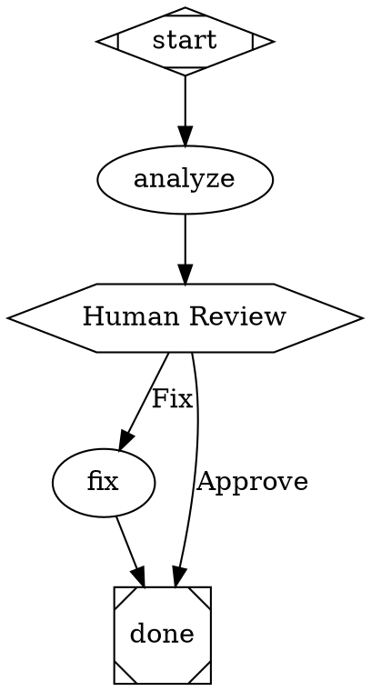

# Attractor Implementation Plan

> **For Claude:** REQUIRED SUB-SKILL: Use superpowers:executing-plans to implement this plan task-by-task.

**Goal:** Implement the Attractor system — a DOT-based pipeline runner for multi-stage AI workflows — as a TypeScript monorepo with three packages.

**Architecture:** Bottom-up build: unified LLM client SDK → coding agent loop → DOT pipeline engine. Each package is fully tested before the next layer depends on it. pnpm monorepo with tsup builds and vitest testing.

**Tech Stack:** TypeScript, pnpm workspaces, tsup, vitest, native fetch API

**Reference specs:** All three specs are in the repo root: `attractor-spec.md`, `coding-agent-loop-spec.md`, `unified-llm-spec.md`. Consult them for exact details.

---

## Phase 1: Monorepo Scaffold

### Task 1.1: Initialize pnpm monorepo

**Files:**
- Create: `package.json`
- Create: `pnpm-workspace.yaml`
- Create: `tsconfig.base.json`
- Create: `.gitignore`
- Create: `.npmrc`

**Step 1: Create root package.json**

```json
{
  "name": "attractor",
  "private": true,
  "type": "module",
  "scripts": {
    "build": "pnpm -r build",
    "test": "pnpm -r test",
    "lint": "pnpm -r lint",
    "clean": "pnpm -r clean"
  },
  "devDependencies": {
    "typescript": "^5.7.0",
    "tsup": "^8.4.0",
    "vitest": "^3.0.0"
  },
  "engines": {
    "node": ">=20.0.0"
  }
}
```

**Step 2: Create pnpm-workspace.yaml**

```yaml
packages:
  - "packages/*"
```

**Step 3: Create tsconfig.base.json**

```json
{
  "compilerOptions": {
    "target": "ES2022",
    "module": "ESNext",
    "moduleResolution": "bundler",
    "lib": ["ES2022"],
    "declaration": true,
    "declarationMap": true,
    "sourceMap": true,
    "strict": true,
    "esModuleInterop": true,
    "skipLibCheck": true,
    "forceConsistentCasingInFileNames": true,
    "resolveJsonModule": true,
    "isolatedModules": true,
    "noUncheckedIndexedAccess": true,
    "noEmit": true
  }
}
```

**Step 4: Create .gitignore**

```
node_modules/
dist/
*.tsbuildinfo
.turbo/
coverage/
.env
.env.*
!.env.example
```

**Step 5: Create .npmrc**

```
auto-install-peers=true
```

**Step 6: Run pnpm install**

Run: `cd /Users/kevinspahn/attractor && pnpm install`
Expected: Creates pnpm-lock.yaml, installs dev dependencies

**Step 7: Commit**

```bash
git add -A && git commit -m "chore: initialize pnpm monorepo scaffold"
```

### Task 1.2: Create llm-client package scaffold

**Files:**
- Create: `packages/llm-client/package.json`
- Create: `packages/llm-client/tsconfig.json`
- Create: `packages/llm-client/tsup.config.ts`
- Create: `packages/llm-client/src/index.ts`

**Step 1: Create package.json**

```json
{
  "name": "@attractor/llm-client",
  "version": "0.1.0",
  "type": "module",
  "main": "./dist/index.cjs",
  "module": "./dist/index.js",
  "types": "./dist/index.d.ts",
  "exports": {
    ".": {
      "import": "./dist/index.js",
      "require": "./dist/index.cjs",
      "types": "./dist/index.d.ts"
    }
  },
  "scripts": {
    "build": "tsup",
    "test": "vitest run",
    "test:watch": "vitest",
    "clean": "rm -rf dist"
  },
  "devDependencies": {
    "typescript": "workspace:*",
    "tsup": "workspace:*",
    "vitest": "workspace:*"
  }
}
```

**Step 2: Create tsconfig.json**

```json
{
  "extends": "../../tsconfig.base.json",
  "compilerOptions": {
    "outDir": "./dist",
    "rootDir": "./src"
  },
  "include": ["src/**/*"]
}
```

**Step 3: Create tsup.config.ts**

```typescript
import { defineConfig } from "tsup";

export default defineConfig({
  entry: ["src/index.ts"],
  format: ["esm", "cjs"],
  dts: true,
  clean: true,
  sourcemap: true,
});
```

**Step 4: Create placeholder src/index.ts**

```typescript
export const VERSION = "0.1.0";
```

**Step 5: Run pnpm install and build**

Run: `cd /Users/kevinspahn/attractor && pnpm install && pnpm --filter @attractor/llm-client build`
Expected: Build succeeds, dist/ created

**Step 6: Commit**

```bash
git add -A && git commit -m "chore: scaffold llm-client package"
```

### Task 1.3: Create agent-loop package scaffold

Same pattern as Task 1.2 but for `packages/agent-loop` with name `@attractor/agent-loop` and a dependency on `@attractor/llm-client`:

```json
"dependencies": {
  "@attractor/llm-client": "workspace:*"
}
```

Commit: `git commit -m "chore: scaffold agent-loop package"`

### Task 1.4: Create attractor package scaffold

Same pattern for `packages/attractor` with name `@attractor/attractor` and dependencies on both:

```json
"dependencies": {
  "@attractor/llm-client": "workspace:*",
  "@attractor/agent-loop": "workspace:*"
}
```

Commit: `git commit -m "chore: scaffold attractor package"`

### Task 1.5: Verify monorepo builds

**Step 1: Install all deps**

Run: `pnpm install`

**Step 2: Build all packages**

Run: `pnpm build`
Expected: All three packages build successfully

**Step 3: Run tests**

Run: `pnpm test`
Expected: All pass (or no tests yet, no failures)

**Step 4: Commit if any changes**

---

## Phase 2: LLM Client — Data Model (Types)

### Task 2.1: Core enums and basic types

**Files:**
- Create: `packages/llm-client/src/types/index.ts`
- Create: `packages/llm-client/src/types/enums.ts`
- Create: `packages/llm-client/tests/types.test.ts`

**Step 1: Write test for Role and ContentKind enums**

```typescript
import { describe, it, expect } from "vitest";
import { Role, ContentKind, StreamEventType } from "../src/types/enums.js";

describe("Role enum", () => {
  it("has all five roles", () => {
    expect(Role.SYSTEM).toBe("system");
    expect(Role.USER).toBe("user");
    expect(Role.ASSISTANT).toBe("assistant");
    expect(Role.TOOL).toBe("tool");
    expect(Role.DEVELOPER).toBe("developer");
  });
});

describe("ContentKind enum", () => {
  it("has all content kinds", () => {
    expect(ContentKind.TEXT).toBe("text");
    expect(ContentKind.IMAGE).toBe("image");
    expect(ContentKind.TOOL_CALL).toBe("tool_call");
    expect(ContentKind.THINKING).toBe("thinking");
  });
});
```

**Step 2: Verify test fails**

Run: `cd packages/llm-client && npx vitest run tests/types.test.ts`
Expected: FAIL (module not found)

**Step 3: Implement enums**

Create `src/types/enums.ts` with all enum values from unified-llm-spec.md Section 3.2, 3.4, 3.14. Use string enums (TypeScript `as const` objects for tree-shaking).

**Step 4: Verify test passes**

Run: `npx vitest run tests/types.test.ts`

**Step 5: Commit**

```bash
git commit -m "feat(llm-client): add Role, ContentKind, StreamEventType enums"
```

### Task 2.2: Message and ContentPart types

**Files:**
- Create: `packages/llm-client/src/types/message.ts`
- Create: `packages/llm-client/tests/message.test.ts`

Implement all types from spec Section 3.1-3.5:
- `Message` interface with `role`, `content`, `name`, `tool_call_id`
- `ContentPart` discriminated union with `kind` field
- `ImageData`, `AudioData`, `DocumentData`, `ToolCallData`, `ToolResultData`, `ThinkingData`
- Convenience constructors: `Message.system()`, `Message.user()`, `Message.assistant()`, `Message.toolResult()`
- `message.text` accessor (concatenate text parts)

TDD: Write tests first for convenience constructors and text accessor.

Commit: `git commit -m "feat(llm-client): add Message and ContentPart types"`

### Task 2.3: Request, Response, and related types

**Files:**
- Create: `packages/llm-client/src/types/request.ts`
- Create: `packages/llm-client/src/types/response.ts`
- Create: `packages/llm-client/tests/response.test.ts`

Implement from spec Sections 3.6-3.12:
- `Request` interface with all fields (model, messages, provider, tools, tool_choice, etc.)
- `Response` interface with convenience accessors (`response.text`, `response.toolCalls`, `response.reasoning`)
- `FinishReason` with unified reason + raw
- `Usage` with addition operator support (implement as a class with `.add()` method)
- `ResponseFormat`, `RateLimitInfo`, `Warning`
- `ToolChoice` with mode and tool_name

TDD: Test Usage addition, Response accessors.

Commit: `git commit -m "feat(llm-client): add Request, Response, Usage types"`

### Task 2.4: StreamEvent types

**Files:**
- Create: `packages/llm-client/src/types/stream.ts`
- Create: `packages/llm-client/tests/stream.test.ts`

Implement from spec Section 3.13-3.14:
- `StreamEvent` interface with type discriminator
- All StreamEventType values
- `StreamAccumulator` class that collects events into a Response

TDD: Test StreamAccumulator processes TEXT_START/TEXT_DELTA/TEXT_END/FINISH into a complete Response.

Commit: `git commit -m "feat(llm-client): add StreamEvent types and StreamAccumulator"`

### Task 2.5: Tool definition types

**Files:**
- Create: `packages/llm-client/src/types/tool.ts`

Implement from spec Section 5.1-5.4:
- `Tool` interface (name, description, parameters, execute?)
- `ToolCall` and `ToolResult` records
- `ToolChoice` record

Commit: `git commit -m "feat(llm-client): add Tool, ToolCall, ToolResult types"`

### Task 2.6: Error hierarchy

**Files:**
- Create: `packages/llm-client/src/types/errors.ts`
- Create: `packages/llm-client/tests/errors.test.ts`

Implement full hierarchy from spec Section 6.1-6.3:
- `SDKError` base class extending Error
- `ProviderError` with provider, status_code, error_code, retryable, retry_after, raw
- All subclasses: `AuthenticationError`, `RateLimitError`, `ServerError`, etc.
- `retryable` flag set correctly per error type

TDD: Test that each error type has correct retryable value, and ProviderError carries all fields.

Commit: `git commit -m "feat(llm-client): add error hierarchy"`

### Task 2.7: Export all types from index.ts

Update `packages/llm-client/src/index.ts` to re-export all types. Create `packages/llm-client/src/types/index.ts` barrel file.

Verify build: `pnpm --filter @attractor/llm-client build`

Commit: `git commit -m "feat(llm-client): export all types from package"`

---

## Phase 3: LLM Client — Provider Utilities (Layer 2)

### Task 3.1: HTTP client wrapper

**Files:**
- Create: `packages/llm-client/src/utils/http.ts`
- Create: `packages/llm-client/tests/utils/http.test.ts`

Thin wrapper around native `fetch`:
- `httpPost(url, body, headers, timeout?)` → Response
- `httpStream(url, body, headers, timeout?)` → ReadableStream
- Timeout support via `AbortSignal.timeout()`
- Header merging helper

TDD: Test with mock fetch (vitest `vi.fn()`).

Commit: `git commit -m "feat(llm-client): add HTTP client utilities"`

### Task 3.2: SSE parser

**Files:**
- Create: `packages/llm-client/src/utils/sse.ts`
- Create: `packages/llm-client/tests/utils/sse.test.ts`

Implement SSE parsing from spec Section 7.7:
- Parse `event:`, `data:` (multiline), `retry:`, comments, blank lines
- Yield `{ event: string, data: string }` tuples
- `parseSSEStream(stream: ReadableStream)` → `AsyncIterableIterator<SSEEvent>`

TDD: Test with known SSE payloads (multi-line data, comments, event types).

Commit: `git commit -m "feat(llm-client): add SSE parser"`

### Task 3.3: Retry utility

**Files:**
- Create: `packages/llm-client/src/utils/retry.ts`
- Create: `packages/llm-client/tests/utils/retry.test.ts`

Implement from spec Section 6.6:
- `RetryPolicy` interface (max_retries, base_delay, max_delay, backoff_multiplier, jitter)
- `retry(fn, policy)` wrapper
- Exponential backoff with jitter: `delay = min(base * multiplier^n, max) * random(0.5, 1.5)`
- Respect `retry_after` from errors
- Only retry errors where `retryable === true`

TDD: Test backoff calculation, jitter bounds, non-retryable error passthrough.

Commit: `git commit -m "feat(llm-client): add retry utility with exponential backoff"`

### Task 3.4: Error mapping utility

**Files:**
- Create: `packages/llm-client/src/utils/error-mapping.ts`

Helper function `mapHttpError(status, body, provider, headers)` → appropriate error subclass. Implements the status code → error type mapping from spec Section 6.4-6.5.

Commit: `git commit -m "feat(llm-client): add HTTP status to error mapping"`

---

## Phase 4: LLM Client — Provider Adapters

### Task 4.1: ProviderAdapter interface

**Files:**
- Create: `packages/llm-client/src/providers/adapter.ts`

```typescript
export interface ProviderAdapter {
  readonly name: string;
  complete(request: Request): Promise<Response>;
  stream(request: Request): AsyncIterableIterator<StreamEvent>;
  close?(): Promise<void>;
  initialize?(): Promise<void>;
  supportsToolChoice?(mode: string): boolean;
}
```

Commit: `git commit -m "feat(llm-client): add ProviderAdapter interface"`

### Task 4.2: Anthropic adapter — request translation

**Files:**
- Create: `packages/llm-client/src/providers/anthropic/index.ts`
- Create: `packages/llm-client/src/providers/anthropic/translate-request.ts`
- Create: `packages/llm-client/tests/providers/anthropic/translate-request.test.ts`

Implement request translation per spec Section 7.3 (Anthropic Message Translation):
- Extract system messages to `system` parameter
- Merge developer messages with system
- Translate ContentParts (text, image, tool_use, tool_result, thinking blocks)
- Handle strict user/assistant alternation (merge consecutive same-role)
- Tool results in user messages
- Auto-inject `cache_control` breakpoints (spec Section 2.10)
- Set `max_tokens` default to 4096
- Pass `anthropic-beta` headers from `provider_options`
- Translate tools per spec Section 7.4

TDD: Test system extraction, message alternation merging, tool result wrapping, thinking block preservation, cache_control injection.

Commit: `git commit -m "feat(llm-client): add Anthropic request translation"`

### Task 4.3: Anthropic adapter — response translation

**Files:**
- Create: `packages/llm-client/src/providers/anthropic/translate-response.ts`
- Create: `packages/llm-client/tests/providers/anthropic/translate-response.test.ts`

Implement response translation per spec Section 7.5:
- Parse content blocks (text, tool_use, thinking, redacted_thinking)
- Map finish reason: end_turn→stop, stop_sequence→stop, max_tokens→length, tool_use→tool_calls
- Extract usage (input_tokens, output_tokens, cache_read/write)
- Preserve raw response

TDD: Test with example Anthropic response payloads.

Commit: `git commit -m "feat(llm-client): add Anthropic response translation"`

### Task 4.4: Anthropic adapter — streaming

**Files:**
- Create: `packages/llm-client/src/providers/anthropic/stream.ts`
- Create: `packages/llm-client/tests/providers/anthropic/stream.test.ts`

Implement streaming translation per spec Section 7.7:
- message_start → STREAM_START
- content_block_start/delta/stop → TEXT_START/DELTA/END, TOOL_CALL_START/DELTA/END, REASONING_START/DELTA/END
- message_delta → extract finish_reason, usage
- message_stop → FINISH with accumulated response

TDD: Test with mock SSE event sequences.

Commit: `git commit -m "feat(llm-client): add Anthropic streaming"`

### Task 4.5: Anthropic adapter — complete() and stream()

**Files:**
- Modify: `packages/llm-client/src/providers/anthropic/index.ts`

Wire up the adapter class implementing `ProviderAdapter`:
- Constructor takes api_key, base_url (default: `https://api.anthropic.com`), default_headers
- `complete()`: build native request → POST `/v1/messages` → translate response
- `stream()`: POST with `stream: true` → parse SSE → translate to StreamEvents
- Set `anthropic-version` header, `x-api-key` header
- Apply beta headers from provider_options

Commit: `git commit -m "feat(llm-client): complete Anthropic adapter"`

### Task 4.6: OpenAI adapter — request translation

**Files:**
- Create: `packages/llm-client/src/providers/openai/index.ts`
- Create: `packages/llm-client/src/providers/openai/translate-request.ts`
- Create: `packages/llm-client/tests/providers/openai/translate-request.test.ts`

Implement for **Responses API** (`/v1/responses`) per spec Section 7.3:
- Extract system to `instructions` parameter
- Translate to `input` array items (not `messages`)
- USER → `{ type: "message", role: "user", content: [...] }`
- ASSISTANT → `{ type: "message", role: "assistant", content: [...] }`
- TOOL_CALL → `{ type: "function_call", id, name, arguments }`
- TOOL_RESULT → `{ type: "function_call_output", call_id, output }`
- ContentPart text → `input_text`/`output_text`
- Set `reasoning.effort` for reasoning models
- Translate tools to `{ type: "function", ... }` wrapper

TDD: Test system extraction, input item translation, tool call/result items.

Commit: `git commit -m "feat(llm-client): add OpenAI Responses API request translation"`

### Task 4.7: OpenAI adapter — response & streaming

**Files:**
- Create: `packages/llm-client/src/providers/openai/translate-response.ts`
- Create: `packages/llm-client/src/providers/openai/stream.ts`
- Create: `packages/llm-client/tests/providers/openai/translate-response.test.ts`

Implement response and streaming for Responses API:
- Parse response output items into ContentParts
- Map finish reasons
- Extract usage including reasoning_tokens from `output_tokens_details`
- Streaming: `response.output_text.delta` → TEXT_DELTA, `response.function_call_arguments.delta` → TOOL_CALL_DELTA, etc.

Commit: `git commit -m "feat(llm-client): add OpenAI response translation and streaming"`

### Task 4.8: OpenAI adapter — complete class

Wire up OpenAI adapter with `complete()` and `stream()` methods using Responses API.
- Bearer token auth
- POST to `/v1/responses`

Commit: `git commit -m "feat(llm-client): complete OpenAI adapter"`

### Task 4.9: OpenAI-compatible adapter

**Files:**
- Create: `packages/llm-client/src/providers/openai-compatible/index.ts`

Separate adapter for Chat Completions API (`/v1/chat/completions`) for third-party endpoints (vLLM, Ollama, etc.). Uses `messages` array format instead of `input`.

Commit: `git commit -m "feat(llm-client): add OpenAI-compatible Chat Completions adapter"`

### Task 4.10: Gemini adapter — request translation

**Files:**
- Create: `packages/llm-client/src/providers/gemini/index.ts`
- Create: `packages/llm-client/src/providers/gemini/translate-request.ts`
- Create: `packages/llm-client/tests/providers/gemini/translate-request.test.ts`

Implement per spec Section 7.3 (Gemini):
- Extract system to `systemInstruction`
- USER → `user` role, ASSISTANT → `model` role
- text → `{ text }`, image → `inlineData`/`fileData`, tool_call → `functionCall`, tool_result → `functionResponse`
- Generate synthetic tool call IDs (`call_<uuid>`) and maintain name mapping
- `functionResponse` uses name (not call ID) and wraps strings in `{ result: "..." }`
- Translate tools to `functionDeclarations`
- Set `maxOutputTokens`, safety settings

TDD: Test system extraction, synthetic ID generation, functionResponse wrapping.

Commit: `git commit -m "feat(llm-client): add Gemini request translation"`

### Task 4.11: Gemini adapter — response & streaming

Implement response parsing and streaming for Gemini:
- Parse `candidates[0].content.parts` → ContentParts
- Map finish reasons (STOP→stop, MAX_TOKENS→length, SAFETY→content_filter)
- Infer tool_calls finish reason from presence of functionCall parts
- Extract usage from `usageMetadata`
- Streaming: use `?alt=sse`, parse SSE, text parts → TEXT_DELTA, functionCall → TOOL_CALL_START+END (complete in one chunk)

Commit: `git commit -m "feat(llm-client): complete Gemini adapter"`

---

## Phase 5: LLM Client — Core Client (Layer 3)

### Task 5.1: Client class

**Files:**
- Create: `packages/llm-client/src/client.ts`
- Create: `packages/llm-client/tests/client.test.ts`

Implement from spec Section 2.2-2.6:

```typescript
export class Client {
  private providers: Map<string, ProviderAdapter>;
  private defaultProvider: string | undefined;
  private middleware: Middleware[];

  constructor(config: ClientConfig);
  static fromEnv(): Client;

  async complete(request: Request): Promise<Response>;
  stream(request: Request): AsyncIterableIterator<StreamEvent>;
  async close(): Promise<void>;
}
```

Key behaviors:
- `fromEnv()`: check env vars (ANTHROPIC_API_KEY, OPENAI_API_KEY, GEMINI_API_KEY), register available adapters
- Provider routing by `request.provider` field, fallback to `defaultProvider`
- `ConfigurationError` when no provider configured or specified
- Middleware chain (onion pattern): request order → provider call → response reverse order
- Streaming middleware wraps the event iterator

TDD: Test provider routing, default provider, missing provider error, middleware execution order.

Commit: `git commit -m "feat(llm-client): add Client class with provider routing and middleware"`

### Task 5.2: Model catalog

**Files:**
- Create: `packages/llm-client/src/catalog.ts`
- Create: `packages/llm-client/tests/catalog.test.ts`

Implement from spec Section 2.9:
- `ModelInfo` record
- Catalog data with models from spec (Claude Opus 4.6, Sonnet 4.5, GPT-5.2 series, Gemini 3 series)
- `getModelInfo(modelId)`, `listModels(provider?)`, `getLatestModel(provider, capability?)`

TDD: Test lookups, filtering by provider, capability filtering.

Commit: `git commit -m "feat(llm-client): add model catalog"`

### Task 5.3: Module-level default client

**Files:**
- Modify: `packages/llm-client/src/index.ts`

Add `setDefaultClient()` and lazy `getDefaultClient()` per spec Section 2.5.

Commit: `git commit -m "feat(llm-client): add module-level default client"`

---

## Phase 6: LLM Client — High-Level API (Layer 4)

### Task 6.1: generate() function

**Files:**
- Create: `packages/llm-client/src/generate.ts`
- Create: `packages/llm-client/tests/generate.test.ts`

Implement from spec Section 4.3, 5.6:
- `generate(options: GenerateOptions): Promise<GenerateResult>`
- Prompt standardization (prompt string → single user message, or full messages)
- System parameter prepended
- Tool execution loop (spec Section 5.6):
  1. Call `client.complete()`
  2. If model returns tool_calls and active tools exist, execute all concurrently
  3. Append assistant message + tool results to conversation
  4. Repeat until: no tool calls, max_tool_rounds reached, or stop_when satisfied
- `GenerateResult` with steps, total_usage, final text
- Retry wrapper using `retry()` utility
- Cancellation via AbortSignal
- Timeout support

TDD: Test with mock client — simple generation, tool loop (mock tool called twice), max_tool_rounds enforcement, parallel tool execution.

Commit: `git commit -m "feat(llm-client): add generate() with tool execution loop"`

### Task 6.2: stream() function

**Files:**
- Create: `packages/llm-client/src/stream-fn.ts`
- Create: `packages/llm-client/tests/stream-fn.test.ts`

Implement from spec Section 4.4:
- `stream(options): StreamResult`
- Same tool loop as generate() but yields events incrementally
- `StreamResult` with async iteration, `response()`, `textStream`
- Emit `step_finish` events between steps

TDD: Test event sequence, text_stream convenience.

Commit: `git commit -m "feat(llm-client): add stream() function"`

### Task 6.3: generateObject() function

**Files:**
- Create: `packages/llm-client/src/generate-object.ts`
- Create: `packages/llm-client/tests/generate-object.test.ts`

Implement from spec Section 4.5:
- Provider-specific structured output strategy:
  - OpenAI: native `response_format: { type: "json_schema" }`
  - Gemini: native `responseMimeType: "application/json"` with `responseSchema`
  - Anthropic: tool-based extraction (define tool matching schema, force call)
- Parse and validate output against schema
- Raise `NoObjectGeneratedError` on failure

TDD: Test with mock responses — successful parse, validation failure.

Commit: `git commit -m "feat(llm-client): add generateObject() for structured output"`

### Task 6.4: Final llm-client exports and build verification

Update `src/index.ts` to export everything. Run full build and test suite.

Run: `pnpm --filter @attractor/llm-client build && pnpm --filter @attractor/llm-client test`

Commit: `git commit -m "feat(llm-client): finalize exports and verify build"`

---

## Phase 7: Agent Loop — Core

### Task 7.1: Tool types and registry

**Files:**
- Create: `packages/agent-loop/src/types.ts`
- Create: `packages/agent-loop/src/tool-registry.ts`
- Create: `packages/agent-loop/tests/tool-registry.test.ts`

Implement from coding-agent-loop-spec Section 3:
- `ToolDefinition` (name, description, parameters JSON Schema)
- `RegisteredTool` (definition + executor function)
- `ToolRegistry` class: register, unregister, get, definitions(), names()
- Latest-wins for name collisions

TDD: Test register, lookup, override, unregister.

Commit: `git commit -m "feat(agent-loop): add ToolRegistry"`

### Task 7.2: Execution environment interface and LocalExecutionEnvironment

**Files:**
- Create: `packages/agent-loop/src/execution-env.ts`
- Create: `packages/agent-loop/tests/execution-env.test.ts`

Implement from spec Section 4:
- `ExecutionEnvironment` interface (read_file, write_file, file_exists, list_directory, exec_command, grep, glob, working_directory, platform)
- `LocalExecutionEnvironment` class:
  - File ops via `node:fs/promises`
  - Command exec via `node:child_process` (spawn in new process group)
  - Timeout: SIGTERM → 2s wait → SIGKILL
  - Environment variable filtering (exclude `*_API_KEY`, `*_SECRET`, etc.)
  - grep via ripgrep subprocess (fallback to grep)
  - glob via `node:fs` + glob library

TDD: Test file read/write, command timeout, env var filtering.

Commit: `git commit -m "feat(agent-loop): add ExecutionEnvironment and LocalExecutionEnvironment"`

### Task 7.3: Built-in tools — file operations

**Files:**
- Create: `packages/agent-loop/src/tools/read-file.ts`
- Create: `packages/agent-loop/src/tools/write-file.ts`
- Create: `packages/agent-loop/src/tools/edit-file.ts`
- Create: `packages/agent-loop/tests/tools/file-tools.test.ts`

Implement per spec Section 3 tool definitions:

**read_file:** Parameters: file_path (required), offset, limit (default 2000). Output: line-numbered text `NNN | content`. Errors: FileNotFound, PermissionDenied, BinaryFile.

**write_file:** Parameters: file_path, content. Output: confirmation with bytes written.

**edit_file:** Parameters: file_path, old_string, new_string, replace_all. Exact match, error on not found or not unique.

TDD: Test each tool with temp files.

Commit: `git commit -m "feat(agent-loop): add file operation tools"`

### Task 7.4: Built-in tools — shell, grep, glob

**Files:**
- Create: `packages/agent-loop/src/tools/shell.ts`
- Create: `packages/agent-loop/src/tools/grep.ts`
- Create: `packages/agent-loop/src/tools/glob.ts`
- Create: `packages/agent-loop/tests/tools/search-tools.test.ts`

**shell:** Parameters: command, timeout_ms, description. Spawns process, captures stdout+stderr, returns { stdout, stderr, exit_code, duration_ms }.

**grep:** Parameters: pattern, path, glob_filter, case_insensitive, max_results. Returns matching lines with file paths and line numbers.

**glob:** Parameters: pattern, path. Returns matching file paths sorted by mtime desc.

TDD: Test shell timeout, grep regex, glob patterns.

Commit: `git commit -m "feat(agent-loop): add shell, grep, glob tools"`

### Task 7.5: Tool output truncation

**Files:**
- Create: `packages/agent-loop/src/truncation.ts`
- Create: `packages/agent-loop/tests/truncation.test.ts`

Implement from spec Section 5:
- `truncateOutput(output, maxChars, mode: 'head_tail' | 'tail')` — character truncation with warning marker
- `truncateLines(output, maxLines)` — line truncation
- `truncateToolOutput(output, toolName, config)` — pipeline: character first, then lines
- Default limits from spec table (read_file: 50k chars, shell: 30k, grep: 20k, etc.)

TDD: Test character truncation (verify marker text), line truncation, pipeline ordering.

Commit: `git commit -m "feat(agent-loop): add tool output truncation"`

### Task 7.6: OpenAI apply_patch tool

**Files:**
- Create: `packages/agent-loop/src/tools/apply-patch.ts`
- Create: `packages/agent-loop/tests/tools/apply-patch.test.ts`

Implement v4a patch format parser from coding-agent-loop-spec Appendix A:
- Parse `*** Begin Patch` / `*** End Patch` envelope
- Operations: Add File, Delete File, Update File (with optional Move to)
- Hunks: `@@` context hint, context/add/delete lines
- Apply operations to filesystem via ExecutionEnvironment

TDD: Test add file, delete file, update file with hunks, move/rename.

Commit: `git commit -m "feat(agent-loop): add apply_patch tool (v4a format)"`

---

## Phase 8: Agent Loop — Session and Provider Profiles

### Task 8.1: Event system

**Files:**
- Create: `packages/agent-loop/src/events.ts`
- Create: `packages/agent-loop/tests/events.test.ts`

Implement event types from spec Section 2.9:
- Event kinds: SESSION_START, SESSION_END, USER_INPUT, ASSISTANT_TEXT_START/DELTA/END, TOOL_CALL_START/OUTPUT_DELTA/END, STEERING_INJECTED, TURN_LIMIT, LOOP_DETECTION, ERROR
- `EventEmitter` class with `on(kind, handler)`, `emit(event)`, async iterator support

TDD: Test event emission and subscription.

Commit: `git commit -m "feat(agent-loop): add event system"`

### Task 8.2: Turn types and history

**Files:**
- Create: `packages/agent-loop/src/turns.ts`

Implement turn types from spec Section 2:
- `UserTurn`, `AssistantTurn`, `ToolResultsTurn`, `SystemTurn`, `SteeringTurn`
- Each with content, timestamp
- `AssistantTurn` adds tool_calls, reasoning, usage, response_id

Commit: `git commit -m "feat(agent-loop): add Turn types"`

### Task 8.3: Provider profiles

**Files:**
- Create: `packages/agent-loop/src/profiles/index.ts`
- Create: `packages/agent-loop/src/profiles/anthropic.ts`
- Create: `packages/agent-loop/src/profiles/openai.ts`
- Create: `packages/agent-loop/src/profiles/gemini.ts`
- Create: `packages/agent-loop/tests/profiles.test.ts`

Implement `ProviderProfile` interface from spec:
```typescript
interface ProviderProfile {
  id: string;
  model: string;
  toolRegistry: ToolRegistry;
  buildSystemPrompt(env: EnvironmentContext, projectDocs: string): string;
  tools(): ToolDefinition[];
  providerOptions(): Record<string, unknown> | undefined;
  supportsReasoning: boolean;
  supportsStreaming: boolean;
  supportsParallelToolCalls: boolean;
  contextWindowSize: number;
}
```

Each profile registers its native tools:
- **Anthropic:** read_file, write_file, edit_file, shell, grep, glob (default timeout: 120s)
- **OpenAI:** read_file, apply_patch, write_file, shell, grep, glob (default timeout: 10s)
- **Gemini:** read_file, write_file, edit_file, shell, grep, glob, list_dir (default timeout: 10s)

Each profile builds provider-specific system prompts (identity, tool guidance, best practices).

TDD: Test tool registration per profile, system prompt includes environment context.

Commit: `git commit -m "feat(agent-loop): add provider profiles (Anthropic, OpenAI, Gemini)"`

### Task 8.4: System prompt assembly

**Files:**
- Create: `packages/agent-loop/src/system-prompt.ts`
- Create: `packages/agent-loop/tests/system-prompt.test.ts`

Implement from spec Section 6:
- Layered assembly: base instructions + environment context + tool descriptions + project docs + user overrides
- Environment context block with working directory, git info, platform, date, model
- Project document discovery: walk directories, find AGENTS.md + provider-specific files
- 32KB total budget for project docs, truncate if exceeded

TDD: Test environment context generation, project doc discovery (with temp directories).

Commit: `git commit -m "feat(agent-loop): add system prompt assembly"`

### Task 8.5: Session class — core agentic loop

**Files:**
- Create: `packages/agent-loop/src/session.ts`
- Create: `packages/agent-loop/tests/session.test.ts`

This is the main agentic loop from spec Section 2:

```typescript
class Session {
  constructor(config: SessionConfig);
  async processInput(input: string): Promise<void>;
  steer(message: string): void;
  followUp(message: string): void;
  abort(): void;
}
```

Core loop in `processInput()`:
1. Check limits (max_tool_rounds_per_input, max_turns, abort)
2. Build LLM request (system prompt + history → messages + tools)
3. Call `Client.complete()` (NOT generate())
4. Record AssistantTurn
5. If no tool_calls → break (natural completion)
6. Execute tool calls (parallel if supported), truncate output
7. Append ToolResultsTurn
8. Drain steering messages
9. Loop detection (check last N calls for repeating patterns)
10. Loop back to step 1

TDD: Test with mock LLM client — natural completion (no tools), single tool round, multi-tool rounds, max_tool_rounds enforcement, loop detection.

Commit: `git commit -m "feat(agent-loop): add Session with core agentic loop"`

### Task 8.6: Loop detection

**Files:**
- Create: `packages/agent-loop/src/loop-detection.ts`
- Create: `packages/agent-loop/tests/loop-detection.test.ts`

Implement from spec: check last N tool calls (default window: 10) for repeating patterns (1-, 2-, 3-length cycles). If detected, inject SteeringTurn warning.

TDD: Test detection of repeated patterns, non-repeating sequences pass.

Commit: `git commit -m "feat(agent-loop): add loop detection"`

### Task 8.7: Subagent support

**Files:**
- Create: `packages/agent-loop/src/subagent.ts`
- Create: `packages/agent-loop/src/tools/subagent-tools.ts`
- Create: `packages/agent-loop/tests/subagent.test.ts`

Implement from spec Section 7:
- `spawn_agent` tool: create child Session with scoped task
- `send_input` tool: send message to child
- `wait` tool: wait for child completion, return SubAgentResult
- `close_agent` tool: terminate child
- Depth limiting (default max: 1)
- Child shares parent's ExecutionEnvironment

TDD: Test spawn, wait, close lifecycle, depth limit enforcement.

Commit: `git commit -m "feat(agent-loop): add subagent support"`

### Task 8.8: Final agent-loop exports and verification

Update exports, run full build and tests.

Commit: `git commit -m "feat(agent-loop): finalize exports and verify build"`

---

## Phase 9: Attractor — DOT Parser

### Task 9.1: DOT lexer/tokenizer

**Files:**
- Create: `packages/attractor/src/parser/lexer.ts`
- Create: `packages/attractor/tests/parser/lexer.test.ts`

Tokenize DOT syntax:
- Keywords: `digraph`, `subgraph`, `node`, `edge`
- Identifiers (quoted and unquoted)
- Operators: `->`, `=`, `{`, `}`, `[`, `]`, `;`, `,`
- Quoted strings with escape sequences
- Comments: `//` line comments, `/* */` block comments
- Numbers, booleans

TDD: Test tokenization of various DOT constructs.

Commit: `git commit -m "feat(attractor): add DOT lexer"`

### Task 9.2: DOT parser — graph structure

**Files:**
- Create: `packages/attractor/src/parser/parser.ts`
- Create: `packages/attractor/src/parser/types.ts`
- Create: `packages/attractor/tests/parser/parser.test.ts`

Parse tokens into graph structure:
- `Graph` with id, attributes, nodes, edges, subgraphs
- `Node` with id, attributes (label, shape, type, prompt, etc.)
- `Edge` with source, target, attributes (label, condition, weight, etc.)
- Handle chained edges: `A -> B -> C [label="x"]` → two edges
- Node/edge default blocks (`node [shape=box]`)
- Subgraph scoping (defaults apply within subgraph)
- Class derivation from subgraph labels

Internal representation types from attractor-spec:
```typescript
interface Graph {
  id: string;
  attributes: GraphAttributes;
  nodes: Map<string, Node>;
  edges: Edge[];
  subgraphs: Subgraph[];
}

interface Node {
  id: string;
  label: string;
  shape: string;
  type: string;
  prompt: string;
  maxRetries: number;
  goalGate: boolean;
  retryTarget: string;
  fidelity: string;
  threadId: string;
  className: string;
  timeout: number | undefined;
  llmModel: string;
  llmProvider: string;
  reasoningEffort: string;
  autoStatus: boolean;
  allowPartial: boolean;
  // ... other attributes from spec
}
```

TDD: Test parsing simple digraph, chained edges, subgraphs, attributes, defaults.

Commit: `git commit -m "feat(attractor): add DOT parser"`

### Task 9.3: Value type parsing

**Files:**
- Create: `packages/attractor/src/parser/values.ts`
- Create: `packages/attractor/tests/parser/values.test.ts`

Parse attribute value types from spec Section 2:
- String (double-quoted with escapes)
- Integer, Float
- Boolean (true/false)
- Duration: integer + unit suffix (ms, s, m, h, d) → milliseconds

TDD: Test duration parsing (`900s` → 900000, `15m` → 900000).

Commit: `git commit -m "feat(attractor): add value type parsing"`

---

## Phase 10: Attractor — State and Context

### Task 10.1: Context (thread-safe key-value store)

**Files:**
- Create: `packages/attractor/src/state/context.ts`
- Create: `packages/attractor/tests/state/context.test.ts`

Implement from attractor-spec Section 5:
```typescript
class Context {
  private values: Map<string, unknown>;
  set(key: string, value: unknown): void;
  get<T>(key: string, defaultValue?: T): T | undefined;
  getString(key: string, defaultValue?: string): string;
  snapshot(): Record<string, unknown>;
  clone(): Context;
  applyUpdates(updates: Record<string, unknown>): void;
}
```

Built-in keys: outcome, preferred_label, graph.goal, current_node, last_stage, last_response, internal.retry_count.<nodeId>.

TDD: Test set/get, snapshot, clone independence, applyUpdates merge.

Commit: `git commit -m "feat(attractor): add Context key-value store"`

### Task 10.2: Outcome and StageStatus

**Files:**
- Create: `packages/attractor/src/state/outcome.ts`

```typescript
enum StageStatus {
  SUCCESS = "success",
  PARTIAL_SUCCESS = "partial_success",
  RETRY = "retry",
  FAIL = "fail",
  SKIPPED = "skipped",
}

interface Outcome {
  status: StageStatus;
  preferredLabel?: string;
  suggestedNextIds?: string[];
  contextUpdates?: Record<string, unknown>;
  notes?: string;
  failureReason?: string;
}
```

Commit: `git commit -m "feat(attractor): add Outcome and StageStatus types"`

### Task 10.3: Checkpoint (serializable state)

**Files:**
- Create: `packages/attractor/src/state/checkpoint.ts`
- Create: `packages/attractor/tests/state/checkpoint.test.ts`

Implement from spec:
```typescript
interface Checkpoint {
  timestamp: string;
  currentNode: string;
  completedNodes: string[];
  nodeRetries: Record<string, number>;
  contextValues: Record<string, unknown>;
  logs: string[];
}
```
- `save(path)` → write JSON
- `load(path)` → read JSON and reconstruct

TDD: Test save/load round-trip.

Commit: `git commit -m "feat(attractor): add Checkpoint serialization"`

### Task 10.4: Artifact store

**Files:**
- Create: `packages/attractor/src/state/artifact-store.ts`
- Create: `packages/attractor/tests/state/artifact-store.test.ts`

Implement from spec:
- In-memory for < 100KB, file-backed for larger
- store, retrieve, has, list, remove, clear

TDD: Test in-memory storage, file-backing threshold.

Commit: `git commit -m "feat(attractor): add ArtifactStore"`

---

## Phase 11: Attractor — Condition Language and Validation

### Task 11.1: Condition expression evaluator

**Files:**
- Create: `packages/attractor/src/conditions.ts`
- Create: `packages/attractor/tests/conditions.test.ts`

Implement from attractor-spec Section 10:
- Parse conditions: `key=value`, `key!=value`, `clause && clause`
- Variable resolution: `outcome`, `preferred_label`, `context.*` keys
- `evaluateCondition(condition, outcome, context)` → boolean

TDD: Test outcome matching, context variable lookup, AND conjunction, negation, empty condition → true, missing context key → empty string.

Commit: `git commit -m "feat(attractor): add condition expression evaluator"`

### Task 11.2: Model stylesheet parser and applicator

**Files:**
- Create: `packages/attractor/src/stylesheet.ts`
- Create: `packages/attractor/tests/stylesheet.test.ts`

Implement from spec Section 8:
- Parse CSS-like rules: `* { llm_model: "claude-opus-4-6"; }`, `.fast { llm_model: "gemini-3-flash-preview"; }`, `#review { reasoning_effort: high; }`
- Selectors: `*` (universal, specificity 0), `.class` (specificity 1), `#id` (specificity 2)
- Properties: `llm_model`, `llm_provider`, `reasoning_effort`
- `applyStylesheet(graph)` → mutate nodes (only set properties not already explicit)

TDD: Test universal selector, class selector, ID selector, specificity ordering, explicit attribute override.

Commit: `git commit -m "feat(attractor): add model stylesheet parser"`

### Task 11.3: Graph validator

**Files:**
- Create: `packages/attractor/src/validator.ts`
- Create: `packages/attractor/tests/validator.test.ts`

Implement all lint rules from spec Section 7:
- `start_node`: exactly one start node (shape=Mdiamond)
- `terminal_node`: at least one exit node (shape=Msquare)
- `reachability`: all nodes reachable from start
- `edge_target_exists`: all edge targets reference existing nodes
- `start_no_incoming`: start has no incoming edges
- `exit_no_outgoing`: exit has no outgoing edges
- `condition_syntax`: conditions parse correctly
- `stylesheet_syntax`: stylesheet parses correctly
- `type_known`: node types are recognized (warning)
- `fidelity_valid`: fidelity modes valid (warning)
- `retry_target_exists`: retry targets exist (warning)
- `goal_gate_has_retry`: goal gate nodes should have retry target (warning)
- `prompt_on_llm_nodes`: LLM nodes should have prompt/label (warning)

```typescript
function validate(graph: Graph, extraRules?: LintRule[]): Diagnostic[];
function validateOrRaise(graph: Graph, extraRules?: LintRule[]): Diagnostic[];
```

TDD: Test each rule with valid and invalid graphs.

Commit: `git commit -m "feat(attractor): add graph validator with lint rules"`

---

## Phase 12: Attractor — Node Handlers

### Task 12.1: Handler interface and registry

**Files:**
- Create: `packages/attractor/src/handlers/handler.ts`
- Create: `packages/attractor/src/handlers/registry.ts`
- Create: `packages/attractor/tests/handlers/registry.test.ts`

```typescript
interface Handler {
  execute(node: Node, context: Context, graph: Graph, logsRoot: string): Promise<Outcome>;
}

class HandlerRegistry {
  register(type: string, handler: Handler): void;
  resolve(node: Node): Handler; // type attribute → shape mapping → default
}
```

Shape-to-handler-type mapping from spec Section 2.

TDD: Test resolution by type attribute, by shape, default fallback.

Commit: `git commit -m "feat(attractor): add Handler interface and registry"`

### Task 12.2: Start and exit handlers

**Files:**
- Create: `packages/attractor/src/handlers/start.ts`
- Create: `packages/attractor/src/handlers/exit.ts`

Both are no-ops returning `Outcome({ status: SUCCESS })`.

Commit: `git commit -m "feat(attractor): add start and exit handlers"`

### Task 12.3: Codergen (LLM) handler

**Files:**
- Create: `packages/attractor/src/handlers/codergen.ts`
- Create: `packages/attractor/tests/handlers/codergen.test.ts`

Implement from spec Section 4 (Codergen Handler):
1. Build prompt: expand `$goal`, use label as fallback
2. Create stage directory: `{logsRoot}/{nodeId}/`
3. Write prompt to `prompt.md`
4. Call LLM backend (via `@attractor/llm-client` generate/stream)
5. Write response to `response.md`
6. Write status to `status.json`
7. Return Outcome with context_updates

The handler receives a `Backend` interface that wraps LLM calls, allowing injection of the llm-client or agent-loop.

TDD: Test with mock backend — prompt expansion, file artifact writing, outcome construction.

Commit: `git commit -m "feat(attractor): add codergen (LLM) handler"`

### Task 12.4: Conditional handler

**Files:**
- Create: `packages/attractor/src/handlers/conditional.ts`

Pass-through no-op. Returns SUCCESS immediately. Edge condition evaluation happens in the engine.

Commit: `git commit -m "feat(attractor): add conditional handler"`

### Task 12.5: Wait-for-human handler

**Files:**
- Create: `packages/attractor/src/handlers/human.ts`
- Create: `packages/attractor/src/interviewer.ts`
- Create: `packages/attractor/tests/handlers/human.test.ts`

Implement from spec Section 6:

**Interviewer interface:**
```typescript
interface Interviewer {
  ask(question: Question): Promise<Answer>;
  inform(message: string, stage: string): Promise<void>;
}
```

**Built-in implementations:**
- `AutoApproveInterviewer`: always YES / first option
- `ConsoleInterviewer`: readline-based CLI prompts
- `CallbackInterviewer`: delegate to provided function
- `QueueInterviewer`: pre-filled answer queue

**Human handler:**
1. Derive choices from outgoing edges (label or target node ID)
2. Parse accelerator keys from labels (`[K] Label`, `K) Label`, etc.)
3. Build Question, present via interviewer
4. Handle timeout (use `human.default_choice` attribute)
5. Return Outcome with `suggestedNextIds`

TDD: Test with QueueInterviewer — choice derivation, accelerator parsing, timeout fallback.

Commit: `git commit -m "feat(attractor): add human-in-the-loop handler and interviewer"`

### Task 12.6: Parallel and fan-in handlers

**Files:**
- Create: `packages/attractor/src/handlers/parallel.ts`
- Create: `packages/attractor/src/handlers/fan-in.ts`
- Create: `packages/attractor/tests/handlers/parallel.test.ts`

**Parallel handler:**
1. Identify outgoing edges (fan-out branches)
2. Determine join policy (wait_all, first_success), error policy, max concurrency
3. Execute branches concurrently, each with isolated context clone
4. Evaluate join policy
5. Store results in `parallel.results`

**Fan-in handler:**
1. Read `parallel.results` from context
2. Rank candidates (by outcome status, score)
3. Record winner in context

TDD: Test parallel execution with mock handlers, join policies.

Commit: `git commit -m "feat(attractor): add parallel and fan-in handlers"`

### Task 12.7: Tool handler

**Files:**
- Create: `packages/attractor/src/handlers/tool.ts`

Execute shell command from `tool_command` attribute, return output in context.

Commit: `git commit -m "feat(attractor): add tool handler"`

### Task 12.8: Coding agent handler

**Files:**
- Create: `packages/attractor/src/handlers/coding-agent.ts`

Wraps `@attractor/agent-loop` Session for nodes that need full agent capability (file editing, shell, iterative problem solving). Spawns a Session with the node's prompt as the task.

Commit: `git commit -m "feat(attractor): add coding agent handler"`

---

## Phase 13: Attractor — Execution Engine

### Task 13.1: Edge selection algorithm

**Files:**
- Create: `packages/attractor/src/engine/edge-selection.ts`
- Create: `packages/attractor/tests/engine/edge-selection.test.ts`

Implement 5-step priority from spec Section 3:
1. Condition-matching edges (evaluate conditions)
2. Preferred label match (normalized comparison)
3. Suggested next IDs
4. Highest weight among unconditional
5. Lexical tiebreak (alphabetical target node ID)

TDD: Test each priority level, tiebreaking.

Commit: `git commit -m "feat(attractor): add edge selection algorithm"`

### Task 13.2: Retry logic

**Files:**
- Create: `packages/attractor/src/engine/retry.ts`
- Create: `packages/attractor/tests/engine/retry.test.ts`

Implement retry policy from spec:
- `max_retries` = additional attempts (max_attempts = max_retries + 1)
- Exponential backoff with jitter
- Preset policies: none, standard, aggressive, linear, patient
- `shouldRetry` predicate for retryable errors

TDD: Test retry counting, backoff delay calculation.

Commit: `git commit -m "feat(attractor): add retry logic"`

### Task 13.3: Pipeline execution engine

**Files:**
- Create: `packages/attractor/src/engine/engine.ts`
- Create: `packages/attractor/tests/engine/engine.test.ts`

The core execution loop from spec Section 3:

```typescript
class PipelineEngine {
  constructor(config: EngineConfig);

  async execute(graph: Graph, options: ExecuteOptions): Promise<PipelineResult>;
}
```

5-phase lifecycle:
1. **Parse:** (already done by parser)
2. **Validate:** Run validator, reject on errors
3. **Initialize:** Create run directory, initial context, checkpoint
4. **Execute:** Main loop:
   - Find start node → execute handler → select next edge → advance → repeat
   - Terminal node check → goal gate enforcement
   - Retry logic on handler failure
   - Context updates from outcomes
   - Checkpoint after each node
   - loop_restart support
5. **Finalize:** Write final checkpoint, emit completion events

**Goal gate enforcement:** Before exit, check all goal_gate nodes. If unsatisfied → route to retry_target chain.

**Failure routing:** FAIL outcome → look for `condition="outcome=fail"` edge → retry_target → fallback → pipeline failure.

TDD: Test with simple linear pipeline (start → task → exit), branching pipeline, retry scenario, goal gate enforcement.

Commit: `git commit -m "feat(attractor): add pipeline execution engine"`

### Task 13.4: Context fidelity management

**Files:**
- Create: `packages/attractor/src/engine/fidelity.ts`
- Create: `packages/attractor/tests/engine/fidelity.test.ts`

Implement fidelity modes from spec Section 5:
- `full`: reuse LLM session (same thread)
- `truncate`: fresh session, minimal context
- `compact`: structured bullet-point summary
- `summary:low/medium/high`: varying detail levels with token budgets

Resolution precedence: edge fidelity → node fidelity → graph default → `compact`

Thread resolution for `full` mode: node thread_id → edge thread_id → subgraph class → previous node ID

TDD: Test fidelity resolution, context building per mode.

Commit: `git commit -m "feat(attractor): add context fidelity management"`

### Task 13.5: Observability events

**Files:**
- Create: `packages/attractor/src/engine/events.ts`

Event types from spec Section 9:
- Pipeline lifecycle: PipelineStarted, PipelineCompleted, PipelineFailed
- Stage lifecycle: StageStarted, StageCompleted, StageFailed, StageRetrying
- Parallel: ParallelStarted, BranchStarted, BranchCompleted, ParallelCompleted
- Human: InterviewStarted, InterviewCompleted, InterviewTimeout
- CheckpointSaved

Engine emits via callback or async iterator pattern.

Commit: `git commit -m "feat(attractor): add pipeline observability events"`

---

## Phase 14: Attractor — Transforms and Integration

### Task 14.1: AST transforms

**Files:**
- Create: `packages/attractor/src/transforms/index.ts`
- Create: `packages/attractor/src/transforms/variable-expansion.ts`
- Create: `packages/attractor/src/transforms/stylesheet-application.ts`
- Create: `packages/attractor/tests/transforms/transforms.test.ts`

Built-in transforms from spec Section 9:
- **Variable expansion:** Replace `$goal` in node prompts with graph.goal
- **Stylesheet application:** Apply model_stylesheet rules to nodes

Pipeline: `parse → transforms → validate → execute`

TDD: Test $goal expansion, stylesheet property application.

Commit: `git commit -m "feat(attractor): add AST transforms"`

### Task 14.2: Pipeline runner (top-level API)

**Files:**
- Create: `packages/attractor/src/runner.ts`
- Create: `packages/attractor/tests/runner.test.ts`

The main entry point:

```typescript
class PipelineRunner {
  constructor(config: RunnerConfig);
  registerTransform(transform: Transform): void;
  registerHandler(type: string, handler: Handler): void;

  async run(dotSource: string, options?: RunOptions): Promise<PipelineResult>;
  async runFile(dotFilePath: string, options?: RunOptions): Promise<PipelineResult>;
}
```

Orchestrates: parse → transform → validate → engine.execute()

TDD: Test with simple DOT pipeline string.

Commit: `git commit -m "feat(attractor): add PipelineRunner top-level API"`

### Task 14.3: Checkpoint resume

**Files:**
- Modify: `packages/attractor/src/engine/engine.ts`
- Create: `packages/attractor/tests/engine/resume.test.ts`

Add resume support to engine:
- Load checkpoint from `{logsRoot}/checkpoint.json`
- Restore context, completed_nodes, retry counters
- Skip already-completed nodes
- Start execution from next node after checkpoint's current_node
- Degrade `full` fidelity to `summary:high` on first resumed node

TDD: Test resume from mid-pipeline checkpoint.

Commit: `git commit -m "feat(attractor): add checkpoint resume"`

### Task 14.4: Final attractor exports and build verification

Update all exports, run full build and test suite across all packages.

Run: `pnpm build && pnpm test`

Commit: `git commit -m "feat(attractor): finalize exports and verify full build"`

---

## Phase 15: Integration and Smoke Tests

### Task 15.1: End-to-end LLM client integration test

**Files:**
- Create: `packages/llm-client/tests/integration/smoke.test.ts`

Integration tests (guarded by env var presence) from unified-llm-spec Section 8.10:
- Simple text generation across all providers
- Streaming
- Tool calling with parallel execution
- Image input
- Structured output
- Error handling

Run only when API keys are present: `ANTHROPIC_API_KEY`, `OPENAI_API_KEY`, `GEMINI_API_KEY`.

Commit: `git commit -m "test(llm-client): add integration smoke tests"`

### Task 15.2: End-to-end agent loop integration test

**Files:**
- Create: `packages/agent-loop/tests/integration/smoke.test.ts`

Integration tests from coding-agent-loop-spec Section 9.13:
- Simple file creation
- Read and edit
- Shell execution
- Truncation verification
- Timeout handling

Commit: `git commit -m "test(agent-loop): add integration smoke tests"`

### Task 15.3: End-to-end attractor pipeline test

**Files:**
- Create: `packages/attractor/tests/integration/smoke.test.ts`

Integration test from attractor-spec Section 11.13:
- Parse 5-node pipeline (plan → implement → review → done)
- Validate (no errors)
- Execute with mock LLM backend
- Verify outcome, goal gates, artifacts, checkpoint

Commit: `git commit -m "test(attractor): add integration smoke test"`

### Task 15.4: Example DOT pipeline

**Files:**
- Create: `examples/simple-pipeline.dot`
- Create: `examples/run-example.ts`

A simple working example demonstrating the full stack:



Commit: `git commit -m "docs: add example pipeline"`

---

## Summary

| Phase | Tasks | Package |
|-------|-------|---------|
| 1 | 1.1-1.5 | Monorepo scaffold |
| 2 | 2.1-2.7 | llm-client types |
| 3 | 3.1-3.4 | llm-client utilities |
| 4 | 4.1-4.11 | llm-client provider adapters |
| 5 | 5.1-5.3 | llm-client core client |
| 6 | 6.1-6.4 | llm-client high-level API |
| 7 | 7.1-7.6 | agent-loop core tools |
| 8 | 8.1-8.8 | agent-loop session & profiles |
| 9 | 9.1-9.3 | attractor DOT parser |
| 10 | 10.1-10.4 | attractor state |
| 11 | 11.1-11.3 | attractor conditions/validation |
| 12 | 12.1-12.8 | attractor handlers |
| 13 | 13.1-13.5 | attractor execution engine |
| 14 | 14.1-14.4 | attractor transforms & runner |
| 15 | 15.1-15.4 | integration tests & examples |
